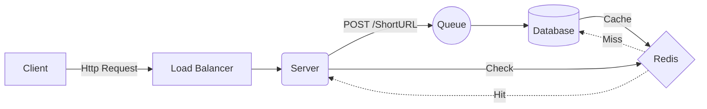
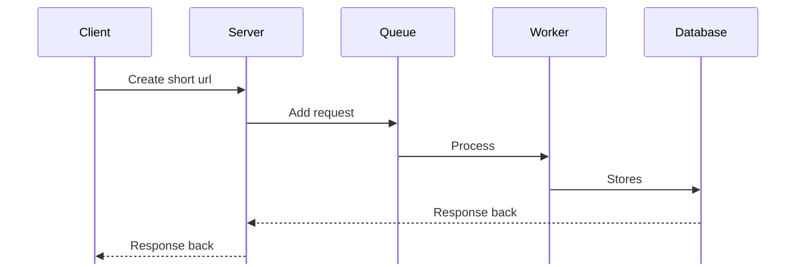
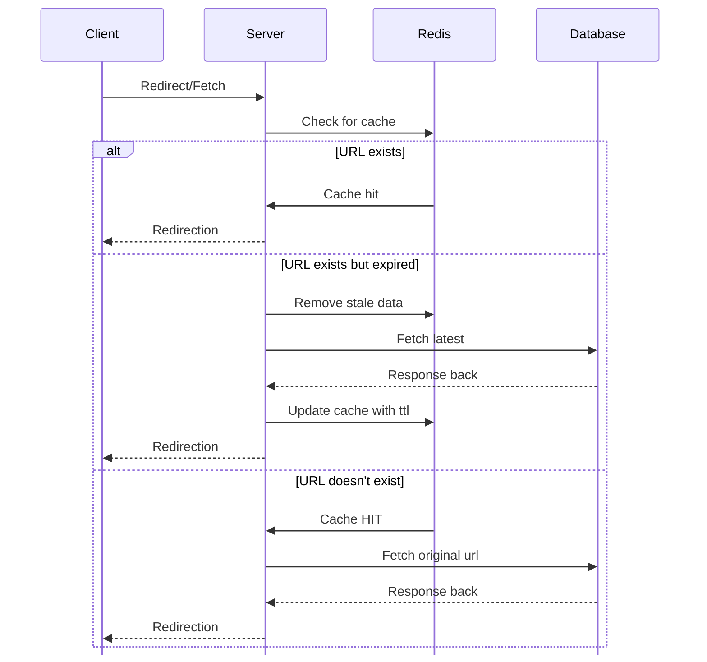
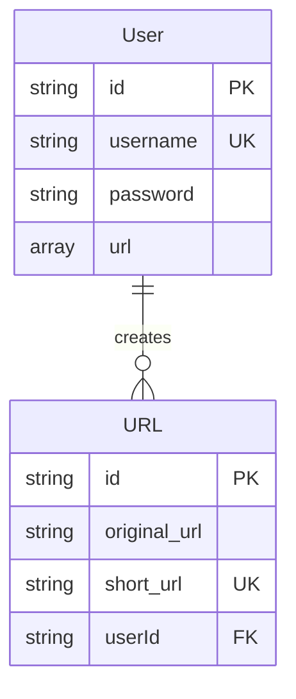

# About
URL Shortener is a website/application that <span class = "concept">converts the lengthy url into a shortened url without changing the IP Address of the url/domain.</span>

> **For Example**
> Original URL : 
> https://preetaroraa/linkedin.com
> 
> Short URL : 
> https://shortbit.ly/ASxSM

## Delivered 
1. Unique hash codes
2. Expirations
3. Custom aliases
4. Collision handling
5. High read volume

# Features
1. Create short url
	- Generates hash code that is unique.
	- On collision adds extra noise to it.
	- Save generated hash to the database and cache it.
2. Fetch original url from short url and redirection
	- Check for the cache.
	- If there, redirects.
	- If not, fetch from database store in cache, then redirects.
3. Expiration 
	- If number of clicks per month is less than 1, mark expired.

> [!Note]
>This is a local project, so things like redis and queue will be replaced by memory. We will be using maps and queue for in memory storage.

## Create Short URL
Requirements : 
1. Hash Generator
	- Parameters required for hashing e.g. original_url, timeStamp, etc.
	- Hashing Algorithm.
2. Collision handling system
	- DB lookup for existing hash code.
	- Add more noise.
	- Retries until hashCode becomes unique.
3. Queue for reducing bottlenecks
	- Requested action will be stored inside queue.
4. Workers for processing queues.

>[!Decission]
>
>Can use min priority queue for first come first serve.

## Fetching / Redirection
Requirements :
1. Map/Redis
```typescript
interface ICacheKey {
	shortUrl: string
}
	
interface ICacheValue{
	longUrl: string,
	ttl : DateTime
}
const cache = new Map<ICacheKey, ICacheValue}>()	
```

2. Cache HIT/MISS/Expired mechanism
	- If cache is there and not expired, redirects.
	- If cache is not there, fetch latest from DB and cache it with ttl.
	- If cache is expired, remove it, fetch from the DB and cache it with new ttl.

## URL Expiration
Requirements :
	1. A worker with scheduler that runs at midnight for db scanning.
	2. Fetch createdAt and clicks.
	3. Ans = trunc(Date.now() - createdAt() / 30) and then Ans <= clicks for skipping else clean.

# Client - Server Achitecture

## For company around 1,000-10,000 users and high spike.




### Software Components
1. User -> create short url, fetch url
2. URL Shortener System -> generates hash code
3. Redis Server -> store cached request for minimising db roundups.
4. Queue -> stores asynchronous request for minimising bottlenecks.

### Creation Designing



### URL Redirection


### ER Diagram

# Algorithm 

## Hashing and Collision Algorithm
Parameters :
1. Original URL
2. Attempts
3. TimeStamp
Generate 4 digit code.
If, after 3 attempts still fail then add another digit. 
```typescript
var attempt = 0
const code = hash(url + timeStamp, attempt) //4 digit code

retry()

if(attempt > 3) {
	increase the digit to +1
}
```

## URL Expiration System
### Rough Idea 
There will be a worker, that is scheduled to be scanning URL table in db.
A formulae that will be used to determine the expiry time of the url and will be compared with the current time.
Calculate delay by getting currentTime and subtracting the time the scheduler need to run.

For calculating the expired URL's. 
Parameter :
- Min 1 CPM (Click per month) required for validity.

Idea is to divide the creation of url by 30 and truncate it.
Then, comparing it with the number of clicks.


