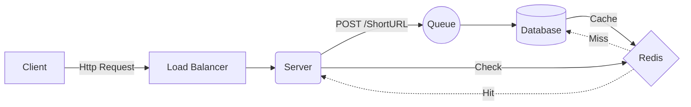
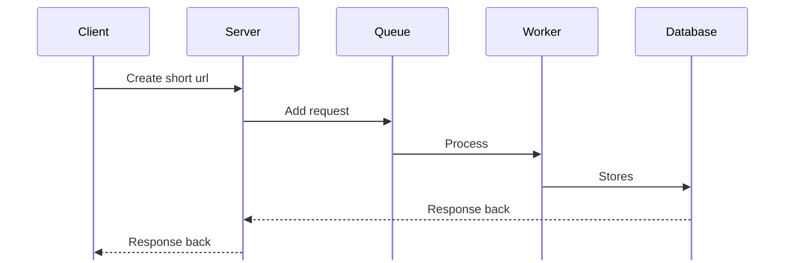
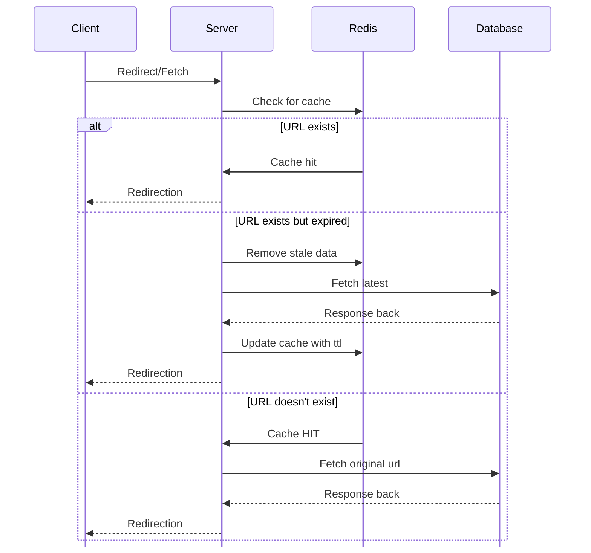
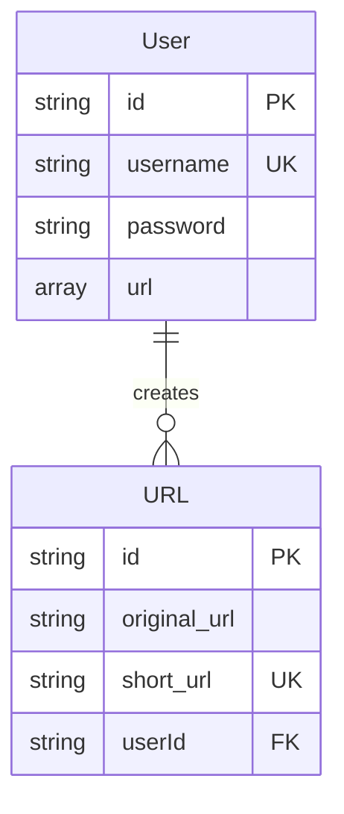

# About
URL Shortener is a website/application that converts the lengthy url into a shortened url without changing the IP Address of the url/domain.

> **For Example**
> Original URL : 
> https://preetaroraa/linkedin.com
> 
> Short URL : 
> https://shortbit.ly/ASxSM

## Delivered 
1. Unique hash codes
2. Expirations
3. Custom aliases
4. Collision handling
5. High read volume

# Client - Server Achitecture

## For company around 1,000-10,000 users and high spike.

### Software Components
1. User -> create short url, fetch url
2. URL Shortener System -> generates hash code
3. Redis Server -> store cached request for minimising db roundups.
4. Queue -> stores asynchronous request for minimising bottlenecks.

### Creation Designing

### URL Redirection

### ER Diagram

